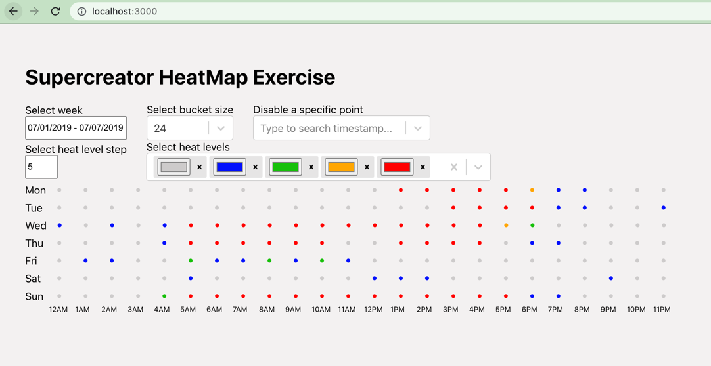

# HeatMap Test Task implementation

Run the project with the following commands:
```
npm install
npm start
```
Open http://localhost:3000


## Selectors
1. Select week - provides the possibility to switch between data for different weeks.
It's automatically calculates which weeks are available for selection.
2. Select bucket size - provides the possibility to select how many columns you will see on the screen. Possible values: 3, 4, 6, 8, 12, 24. Default value is 24.
When select low count of bucket - it connects the amount of points between start and end time of each bucket.
3. Disable a specific point - dropdown with list of all points. It's needed to start typing for looked timestamp(Example value: '2019-07-01T13:39:12') and turn off the checkbox in order to disable it.
4. Select heat level step - defines how many points needed to change color to bigger heat map level. By default, color is changing every 5 points. 
5. Select heat levels - multiselect for adding new heat levels. Open dropdown to view color picker and select specific color for new level and press 'submit' button.
You cannot select less than 5 colors.


## Heatmap
Main heatmap has got the table view with Weeks rows and Hours columns. Each cell represent how many points is included in the specific hour each day. 